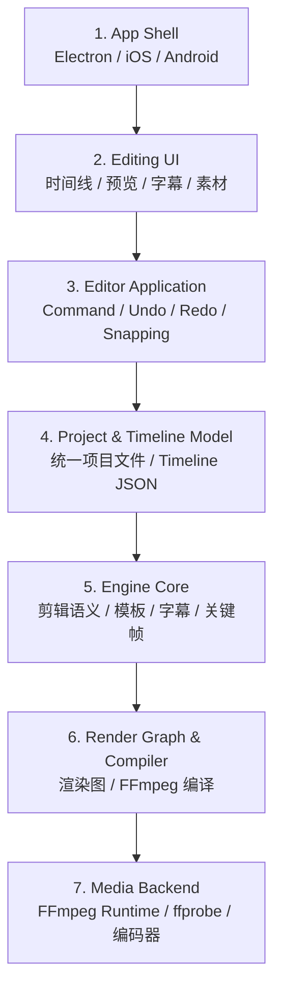
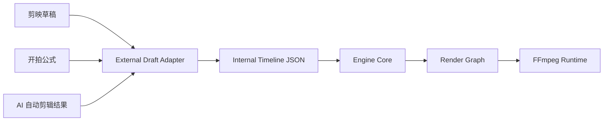
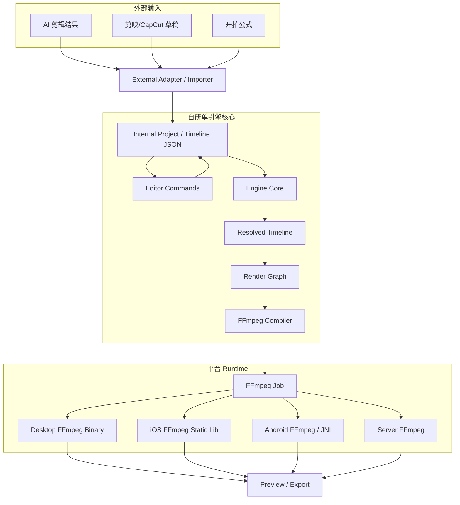

# AI 口播剪辑跨端单引擎 Engine Guideline

> 版本：v0.1  
> 日期：2026-06-13  
> 适用范围：Electron 桌面端 AI 剪辑产品、未来 iOS / Android App、服务端/云端渲染兜底  
> 核心目标：**同一套剪辑语义、同一套项目格式、同一套引擎核心，覆盖桌面端与 App 端。**

---

## 0. 一句话结论

本项目不要 fork 或魔改 Shotcut / Kdenlive / OpenShot 这类完整桌面剪辑器，也不要把 MLT 直接作为移动端 runtime。

最终路线建议是：

```text
主参考应用：Kdenlive
中层参考模型：MLT
底层媒体执行：FFmpeg
自研核心：Timeline Model + Engine Core + Render Graph + FFmpeg Compiler
长期语言：Rust 为主，C++ 只在深度绑定 libav* / 特殊性能模块时使用
```

也就是：

```text
Electron / iOS / Android UI
        ↓
Editor Command
        ↓
统一 Timeline JSON
        ↓
自研 Engine Core
        ↓
Render Graph
        ↓
FFmpeg Compiler
        ↓
FFmpeg Runtime
        ↓
预览 / 导出
```

核心原则：

> **FFmpeg 是底层媒体执行器，不是完整剪辑引擎。真正的剪辑引擎是你自己的中间层。**

---

## 1. 项目目标与硬约束

### 1.1 目标

本引擎面向 AI 口播剪辑产品，重点支持：

- 长视频口播自动剪成短视频
- ASR 后按内容结构重排
- 用户可在桌面端 / App 端继续微调
- 字幕、花字、贴纸、蒙版、BGM、音效、运镜、模板包装
- 桌面端本地导出
- App 端轻编辑与本地/云端导出
- 后续兼容部分剪映 / CapCut / 开拍类草稿或模板公式

### 1.2 硬约束

必须满足：

```text
1. 单引擎
2. 跨桌面端、iOS、Android
3. 剪辑行为一致
4. 内部项目格式可长期演进
5. 商业产品可控
6. 不绑定某一个开源桌面编辑器 UI
7. 不把 FFmpeg 命令散落在业务代码里
```

### 1.3 单引擎的定义

这里的“单引擎”不是指所有平台必须用完全相同的 UI 或完全相同的二进制调用方式，而是指：

```text
相同：
- Timeline JSON
- Command 语义
- Engine Core
- Render Graph
- FFmpeg Compiler
- 模板解释规则
- 字幕布局规则
- 关键帧插值规则
- 外部草稿兼容规则

不同：
- Electron / iOS / Android UI
- 平台文件权限
- FFmpeg binary / static lib / wrapper
- 硬件编码器选择
```

只要真正的剪辑语义和渲染计划来自同一套核心，就可以认为是单引擎。

---

## 2. 最终技术路线

### 2.1 为什么不直接用 Kdenlive / Shotcut / OpenShot？

这些项目是很好的参考，但不适合作为本项目的直接底座。

| 项目 | 适合作为 | 不适合作为 |
|---|---|---|
| Kdenlive | 上层剪辑应用参考 | 直接嵌入 Electron/App |
| Shotcut | 轻量 MLT 应用参考 | 商业跨端核心引擎 |
| OpenShot / libopenshot | SDK 边界参考 | App + 桌面单引擎主路线 |
| MLT | 非线编中层架构参考 | 移动端 runtime 主线 |
| Olive | Render Graph / 现代 NLE 思路参考 | 生产级底座 |
| Pitivi / GES | Timeline / Layer / Clip 模型参考 | 本项目主技术栈 |

### 2.2 为什么主参考选 Kdenlive？

Kdenlive 是完整的非线性视频编辑器，项目结构和时间线能力足够复杂，适合作为“上层应用设计参考”。Kdenlive 的 `.kdenlive` 项目文件使用基于 MLT 的 XML 格式，用来描述源媒体以及这些媒体在时间线中的使用方式，这一点很适合本项目参考项目文件能力边界。

本项目只参考 Kdenlive 的：

```text
- 项目文件能力
- 时间线模型
- 多轨组织方式
- clip / segment / effect / transition 的表达方式
- 复杂编辑行为
- proxy / render / media reference 的设计思路
```

不复制：

```text
- Qt/KDE UI 代码
- GPL 项目代码
- Kdenlive 的内部工程结构
- Kdenlive 对 MLT 的运行时依赖方式
```

### 2.3 为什么中层参考 MLT？

MLT 的核心价值是它提供了成熟的非线编引擎抽象，例如 Producer、Filter、Transition、Consumer 等。它适合用来理解一个剪辑工程如何被组织和执行。

本项目借鉴 MLT 的抽象，但不把 MLT 当成 App + 桌面统一 runtime。

映射关系：

| MLT 概念 | 本项目自研概念 |
|---|---|
| Producer | MediaSource / AssetSource |
| Playlist | TrackSequence |
| Tractor | TimelineComposition |
| Filter | EffectNode |
| Transition | TransitionNode |
| Consumer | Preview / Export Consumer |

### 2.4 为什么底层执行选 FFmpeg？

FFmpeg 是跨平台底层音视频处理工具和库，适合承担：

```text
- 解码
- 编码
- 裁剪
- 拼接
- 缩放
- 裁切
- overlay
- 混音
- 字幕烧录
- filtergraph 执行
- MP4/MOV 等封装
```

但 FFmpeg 不负责产品层剪辑语义，例如“主轨”“贴纸轨”“口播片段”“爆点片段”“模板占位符”“字幕样式”等。

所以本项目要做的是：

```text
Timeline JSON
        ↓
Engine Core
        ↓
Render Graph
        ↓
FFmpeg filter_complex / command
        ↓
FFmpeg Runtime
```

---

## 3. 7 层架构

概念上分 7 层，工程实现上可以合并成 5 个核心模块。



### 3.1 第 1 层：App Shell

平台壳层。

职责：

```text
- Electron / iOS / Android 工程壳
- 文件选择与权限
- 本地存储
- 任务进程管理
- 崩溃日志
- 更新机制
- FFmpeg binary / static lib 装载
```

是否共享：**不强制共享**。

### 3.2 第 2 层：Editing UI

用户界面层。

职责：

```text
- 时间线 UI
- 预览窗口
- 字幕编辑器
- 素材库
- 参数面板
- 模板选择
- 封面编辑器
```

原则：

```text
UI 不直接改 FFmpeg。
UI 不直接拼 filter_complex。
UI 只发 Command。
```

桌面端和 App 端 UI 可以不同。

### 3.3 第 3 层：Editor Application / Command

编辑操作层。

职责：

```text
- SplitClipCommand
- TrimClipCommand
- MoveClipCommand
- DeleteClipCommand
- ChangeSubtitleTextCommand
- ApplyTemplateCommand
- ChangeBgmVolumeCommand
- Undo / Redo
- Snapping
- Selection
- Drag state
```

原则：

```text
用户分割片段，不是立即用 FFmpeg 切文件；
而是修改 Timeline JSON 里的 clip 结构。
```

### 3.4 第 4 层：Project / Timeline Model

统一项目模型层。

职责：

```text
- 项目文件
- 素材引用
- 轨道
- clip
- 字幕
- 贴纸
- 蒙版
- 音频
- 模板实例
- 版本迁移
```

这是跨端一致的第一核心。

### 3.5 第 5 层：Engine Core

真正的剪辑语义引擎。

职责：

```text
- 时间线规范化
- track / clip 解析
- 时间映射
- 轨道叠放规则
- 片段冲突规则
- 字幕布局
- 模板展开
- 贴纸/文字/蒙版/运镜语义解析
- 关键帧插值
- easing 计算
- 音频混合语义
- 预览与导出一致性
```

这是跨端一致性的最重要部分。

### 3.6 第 6 层：Render Graph / Compiler

渲染计划层。

职责：

```text
- 把剪辑语义转成 Render Graph
- 把 Render Graph 编译成 FFmpeg filter_complex
- 生成 ASS 字幕文件
- 生成临时图片/透明视频/alpha matte
- 生成编码参数
- 生成预览任务和导出任务
```

原则：

```text
Engine Core 不直接吐 FFmpeg 命令。
Engine Core 输出中间渲染图。
Compiler 再把渲染图转成 FFmpeg。
```

### 3.7 第 7 层：Media Backend / FFmpeg Runtime

媒体执行层。

职责：

```text
- ffprobe 读取素材信息
- 执行 ffmpeg
- 进度解析
- 取消任务
- 临时文件管理
- 错误分类
- 编码器选择
- 硬件编码开关
```

平台实现可以不同：

```text
Desktop：ffmpeg binary + child_process
iOS：自编译 FFmpeg static lib / FFmpegKit fork / Swift bridge
Android：自编译 FFmpeg / FFmpegKit fork / JNI
Server：ffmpeg binary / Docker
```

---

## 4. 工程模块建议

概念上 7 层，工程上建议先落为 5 个核心模块。

```text
apps/
  desktop-electron/
  mobile-ios/
  mobile-android/
  server-renderer/             # 可选

crates/
  editor_model/                # Project / Timeline Model
  editor_commands/             # Command / Undo / Redo
  engine_core/                 # 剪辑语义核心
  render_graph/                # Render Graph + Compiler
  ffmpeg_runtime/              # FFmpeg 执行封装

bindings/
  node/                        # Electron / Node binding
  swift/                       # iOS binding
  android-jni/                 # Android binding
  dart-ffi/                    # 如果未来用 Flutter
```

### 4.1 语言路线

建议分阶段：

```text
阶段 1：
TypeScript 快速验证 Timeline JSON、Command、FFmpeg Compiler。

阶段 2：
Rust 重写 editor_model、engine_core、render_graph、ffmpeg_compiler。

阶段 3：
移动端和桌面端通过 FFI / N-API / JNI 调同一套 Rust Core。

阶段 4：
只有在需要深度接 libav* 或特殊高性能图像处理时，引入 C++。
```

Rust 优先原因：

```text
- 数据模型强
- 序列化友好
- 跨端 FFI 能力好
- 内存安全
- 适合写确定性的 Engine Core
```

C++ 适合：

```text
- libav* 深度绑定
- GPU / OpenGL / Metal / Vulkan 特殊模块
- 某些第三方媒体库集成
```

---

## 5. 内部项目格式原则

内部格式不要使用 `.kdenlive`、MLT XML、剪映 JSON、开拍公式作为主格式。

必须自定义：

```text
project.json / timeline.json
```

外部格式全部通过 Adapter 转进来。



### 5.1 时间单位

不要在核心层使用裸 `float` 表达时间。

建议：

```text
内部时间：i64 microseconds 或 RationalTime
帧时间：frame_index + fps rational
显示时间：UI 再转秒
```

推荐结构：

```rust
struct Time {
    micros: i64
}

struct FrameRate {
    num: u32, // 30000
    den: u32, // 1001
}
```

原因：

```text
- 避免跨端浮点误差
- 方便做 deterministic tests
- 方便适配 29.97fps / 59.94fps
```

### 5.2 坐标系

建议内部统一：

```text
画布原点：中心点
x：向右为正
y：向下为正
scale：1.0 表示原始适配尺寸
rotation：角度制，顺时针为正
opacity：0.0 - 1.0
```

同时支持模板使用归一化单位：

```text
normalized_x: -1.0 ~ 1.0
normalized_y: -1.0 ~ 1.0
```

Engine Core 负责把模板归一化坐标转换成画布像素坐标。

### 5.3 Timeline JSON 示例

```json
{
  "version": 1,
  "canvas": {
    "width": 1080,
    "height": 1920,
    "fps": { "num": 30, "den": 1 },
    "background": "#000000"
  },
  "assets": [
    {
      "id": "asset_video_001",
      "type": "video",
      "uri": "file:///input.mp4",
      "mediaInfo": {
        "durationMicros": 420000000,
        "width": 3840,
        "height": 2160,
        "hasAudio": true
      }
    }
  ],
  "tracks": [
    {
      "id": "track_main_video",
      "type": "video",
      "zIndex": 0,
      "clips": [
        {
          "id": "clip_001",
          "assetId": "asset_video_001",
          "sourceInMicros": 12300000,
          "sourceOutMicros": 18700000,
          "timelineInMicros": 0,
          "timelineOutMicros": 6400000,
          "speed": 1.0,
          "transform": {
            "x": 0,
            "y": -80,
            "scale": 1.12,
            "rotation": 0,
            "opacity": 1.0
          }
        }
      ]
    },
    {
      "id": "track_subtitle",
      "type": "text",
      "zIndex": 10,
      "clips": [
        {
          "id": "text_001",
          "timelineInMicros": 200000,
          "timelineOutMicros": 2800000,
          "text": "今天我来讲一个很多老板都踩过的坑",
          "styleId": "viral_caption_001"
        }
      ]
    }
  ]
}
```

---

## 6. Engine Core 设计

Engine Core 是本项目最核心的资产。

### 6.1 Engine Core 输入输出

输入：

```text
Project / Timeline JSON
EditCommand
Template definitions
Asset metadata
Render intent
```

输出：

```text
NormalizedTimeline
ResolvedTimeline
FrameState
RenderGraph
CompatibilityReport
```

### 6.2 Engine Core 主要能力

```rust
struct EngineCore;

impl EngineCore {
    fn load_project(input: ProjectJson) -> Result<Project>;
    fn apply_command(project: Project, command: EditCommand) -> Result<Project>;
    fn normalize(project: Project) -> Result<NormalizedTimeline>;
    fn resolve_templates(timeline: NormalizedTimeline) -> Result<ResolvedTimeline>;
    fn evaluate_at(timeline: &ResolvedTimeline, time: Time) -> Result<FrameState>;
    fn build_render_graph(timeline: ResolvedTimeline, intent: RenderIntent) -> Result<RenderGraph>;
}
```

### 6.3 关键语义必须在 Engine Core 内统一

以下规则不能散落在 UI 或平台端：

```text
- clip sourceIn/sourceOut/timelineIn/timelineOut 计算
- split 后 clip ID 生成规则
- trim 时 source range 与 timeline range 的关系
- speed 对时长的影响
- 轨道 zIndex 规则
- overlap 处理规则
- ripple edit 规则
- snapping 规则
- 字幕行高、换行、描边、阴影
- 模板占位符展开
- 关键帧插值
- 运镜 easing
- 蒙版坐标与羽化
- 音量叠加与 ducking
```

---

## 7. Render Graph 设计

Render Graph 是 Engine Core 与 FFmpeg 之间的中间层。

不要让 Engine Core 直接拼 FFmpeg 命令。

### 7.1 Render Node 示例

```rust
enum RenderNode {
    DecodeVideo {
        asset_id: AssetId,
    },
    DecodeAudio {
        asset_id: AssetId,
    },
    Trim {
        input: NodeId,
        start: Time,
        end: Time,
    },
    SetPts {
        input: NodeId,
        speed: f64,
    },
    Scale {
        input: NodeId,
        width: u32,
        height: u32,
    },
    Crop {
        input: NodeId,
        rect: Rect,
    },
    Transform {
        input: NodeId,
        x: AnimatedValue,
        y: AnimatedValue,
        scale: AnimatedValue,
        rotation: AnimatedValue,
        opacity: AnimatedValue,
    },
    Overlay {
        base: NodeId,
        layer: NodeId,
        x: AnimatedValue,
        y: AnimatedValue,
        start: Time,
        end: Time,
    },
    TextLayer {
        text: TextRun,
        style: TextStyle,
        timing: TimeRange,
    },
    Mask {
        input: NodeId,
        mask: MaskSpec,
    },
    AudioMix {
        inputs: Vec<NodeId>,
    },
    Encode {
        video: NodeId,
        audio: Option<NodeId>,
        settings: EncodeSettings,
    },
}
```

### 7.2 Render Intent

同一条 Timeline 可以生成不同 intent 的渲染任务：

```text
ExportFinal：最终导出
PreviewSegment：局部预览
PreviewFrame：单帧预览
ProxyGenerate：代理文件生成
ThumbnailGenerate：缩略图生成
WaveformGenerate：波形生成
```

示例：

```rust
enum RenderIntent {
    ExportFinal {
        output: PathBuf,
        width: u32,
        height: u32,
        fps: FrameRate,
        quality: ExportQuality,
    },
    PreviewSegment {
        range: TimeRange,
        scale: f32,
    },
    PreviewFrame {
        time: Time,
    },
    ProxyGenerate,
    ThumbnailGenerate,
    WaveformGenerate,
}
```

---

## 8. FFmpeg Compiler 与 Runtime

### 8.1 Compiler 职责

FFmpeg Compiler 把 Render Graph 转成：

```text
- ffmpeg input list
- filter_complex_script
- ASS subtitle file
- temporary images
- alpha matte
- encoder arguments
- output path
```

### 8.2 Runtime 职责

FFmpeg Runtime 只负责执行，不负责剪辑语义。

```rust
trait FfmpegRuntime {
    fn probe(&self, input: &Path) -> Result<MediaInfo>;
    fn render(&self, job: FfmpegJob) -> Result<RenderResult>;
    fn cancel(&self, job_id: JobId) -> Result<()>;
}
```

### 8.3 CLI 优先，libav* 后置

第一阶段建议用：

```text
ffmpeg binary + filter_complex_script
```

原因：

```text
- 调试快
- 容易复现
- 失败日志清楚
- 可快速验证 Timeline Compiler
```

等核心模型稳定后，再考虑：

```text
libavformat
libavcodec
libavfilter
libswscale
libswresample
```

### 8.4 FFmpegKit 策略

FFmpegKit 已官方退休，不能作为长期直接依赖。

可选策略：

```text
短期：
- 使用社区 fork 或临时 fork 做 POC

长期：
- 自维护 Android / iOS FFmpeg build
- 保留 FFmpegKit 类 wrapper 接口
- 不依赖原官方预编译包
```

---

## 9. 预览策略

实时预览是剪辑引擎难点。不要一开始追求剪映/CapCut 级别完全实时。

建议分三层：

### 9.1 代理文件预览

导入素材后生成：

```text
proxy.mp4
waveform.json
thumbs/*.jpg
media_info.json
```

用途：

```text
- 时间线拖动更快
- 低清预览
- App 端降低性能压力
```

### 9.2 局部窗口渲染预览

用户停在某个时间点附近时，只渲染短窗口：

```text
当前时间：30s
渲染窗口：28s - 34s
输出：preview_28_34.mp4
```

适合：

```text
- 字幕/贴纸/蒙版/运镜预览
- 模板包装预览
- App 端低清片段缓存
```

### 9.3 单帧预览

拖动进度条或精确定位时，生成当前帧：

```text
timeline time → RenderGraph → FFmpeg one frame → preview.png
```

适合：

```text
- 调字幕位置
- 调贴纸位置
- 调封面
- 验证模板效果
```

---

## 10. 字体、字幕、贴纸、蒙版、运镜的实现策略

### 10.1 字体 / 字幕 / 花字

基础字幕可走：

```text
Text Model → ASS → FFmpeg subtitles/libass
```

复杂花字建议：

```text
Text Model
  ↓
Text Layout / Graphics Renderer
  ↓
透明 PNG 序列 / 透明视频 / alpha layer
  ↓
FFmpeg overlay
```

第一版必须支持：

```text
- font family
- font size
- font weight
- fill color
- stroke
- shadow
- background box
- line height
- text align
- per-word timing
- karaoke highlight
```

复杂效果后置：

```text
- 逐字弹跳
- 粒子字
- 复杂渐变
- 3D 字
- 专有花字模板
```

### 10.2 贴纸

贴纸本质是独立图层：

```text
PNG / WebP / GIF / APNG / video / Lottie
        ↓
transform
        ↓
keyframes
        ↓
overlay
```

内部模型：

```json
{
  "type": "sticker",
  "assetId": "sticker_001",
  "timelineInMicros": 1200000,
  "durationMicros": 3000000,
  "transform": {
    "x": 120,
    "y": 300,
    "scale": 1.0,
    "rotation": 0,
    "opacity": 1
  },
  "keyframes": [
    {
      "timeMicros": 0,
      "scale": 0.5,
      "opacity": 0
    },
    {
      "timeMicros": 200000,
      "scale": 1.0,
      "opacity": 1
    }
  ]
}
```

### 10.3 蒙版

第一版支持：

```text
- rectangle
- circle
- linear
- alpha matte
- feather
- invert
- position
- rotation
- size
```

复杂蒙版可以通过：

```text
MaskSpec → alpha matte image/video → FFmpeg alphamerge/overlay
```

内部模型：

```json
{
  "type": "mask",
  "maskType": "circle",
  "center": { "x": 0.5, "y": 0.5 },
  "size": 0.6,
  "feather": 0.12,
  "invert": false
}
```

### 10.4 运镜

运镜本质是 Transform Keyframes。

支持属性：

```text
- x
- y
- scale
- rotation
- crop
- opacity
- easing
```

示例：

```json
{
  "transformKeyframes": [
    {
      "timeMicros": 0,
      "scale": 1.0,
      "x": 0,
      "y": 0,
      "easing": "easeOut"
    },
    {
      "timeMicros": 2000000,
      "scale": 1.18,
      "x": -40,
      "y": -80,
      "easing": "easeInOut"
    }
  ]
}
```

---

## 11. 外部草稿 / 模板公式兼容策略

### 11.1 核心原则

不要直接渲染外部草稿。

统一流程是：

```text
剪映草稿 / CapCut 草稿 / 开拍公式
        ↓
External Draft Adapter
        ↓
Internal Timeline JSON
        ↓
Engine Core
        ↓
Render Graph
        ↓
FFmpeg Runtime
```

### 11.2 Adapter 输出必须包含兼容报告

```json
{
  "timeline": {},
  "compatibility": {
    "level": "partial",
    "supported": [
      "video_clips",
      "audio_clips",
      "text",
      "basic_stickers",
      "basic_masks",
      "transform_keyframes"
    ],
    "unsupported": [
      "proprietary_effect_7342020000812731658",
      "ai_background_removal",
      "unknown_text_bubble"
    ],
    "warnings": [
      "缺少贴纸资源，已使用占位图",
      "专有花字效果无法复刻，已降级为普通描边文字"
    ]
  }
}
```

### 11.3 兼容等级

| 等级 | 能力 | 可行性 |
|---|---|---|
| L0 | 读取素材、轨道、片段、时间范围 | 高 |
| L1 | 裁剪、拼接、音频、基础字幕 | 高 |
| L2 | 缩放、旋转、透明度、关键帧、基础运镜 | 高 |
| L3 | 普通贴纸、图片、视频 overlay、基础蒙版 | 中高 |
| L4 | 内置花字、气泡、特效、动画 | 中 |
| L5 | 专有滤镜、人物特效、智能抠像、复杂模板 | 低 |
| L6 | 100% 像素级复刻剪映/开拍渲染 | 不作为目标 |

### 11.4 剪映 / CapCut 草稿

可做：

```text
- 解析未加密草稿
- 读取 tracks / materials / segments
- 映射视频片段、音频片段、文本片段
- 映射基础 transform
- 映射基础 keyframe
- 映射基础 mask
```

谨慎：

```text
- 版本差异
- 草稿加密
- 专有 resource_id
- 内置模板资源缺失
- 特效语义不公开
- 字体资源缺失
```

原则：

```text
只处理用户合法提供、可读取、未加密或已合法解密的草稿与素材。
不设计绕过 DRM、加密、访问控制的能力。
```

### 11.5 开拍公式

如果可以合法拿到完整公式、素材和字段语义，可以做：

```text
KaipaiFormulaAdapter → Internal Timeline JSON
```

如果只能拿到黑盒 formula / 私有 effect id / 私有 resource id，则只能部分还原。

产品承诺建议：

```text
支持常见口播模板结构兼容；
不承诺 100% 复刻开拍私有渲染。
```

---

## 12. 功能优先级

### 12.1 V0：最小可用引擎

目标：跑通 AI 口播剪辑闭环。

支持：

```text
- 单主视频轨
- 裁剪 / 拼接
- sourceIn / sourceOut / timelineIn / timelineOut
- 基础字幕
- BGM
- 音量
- 简单封面
- FFmpeg 导出
- 桌面端预览缓存
```

不做：

```text
- 复杂多轨
- 复杂蒙版
- 复杂花字
- 外部草稿完整兼容
- App 端完整导出
```

### 12.2 V1：产品可用引擎

支持：

```text
- 多视频轨
- 文本轨
- 贴纸轨
- BGM / 音效轨
- 基础 transform keyframe
- 基础蒙版
- ASS 字幕
- proxy / thumbnail / waveform
- Render Graph
- FFmpeg filter_complex_script
- Golden render tests
```

### 12.3 V2：跨端单引擎

支持：

```text
- Rust Engine Core
- Electron binding
- iOS binding
- Android binding
- 移动端 FFmpeg build
- 局部预览缓存
- 外部草稿 Adapter 初版
- 兼容报告
```

### 12.4 V3：模板与高级效果

支持：

```text
- 模板协议
- 复杂字幕/花字
- Lottie/Rive 类动画贴纸
- alpha matte 蒙版
- 字幕逐字高亮
- 复杂运镜 preset
- GPU/Skia/Graphics Renderer 可选模块
```

---

## 13. 测试体系

### 13.1 必须有 Golden Project

为每类功能准备固定测试工程：

```text
goldens/
  basic_cut/
  subtitle_ass/
  sticker_overlay/
  mask_circle/
  camera_move/
  audio_mix/
  draft_import_jianying_l1/
```

每个工程包含：

```text
- project.json
- input assets
- expected metadata
- expected frame snapshots
- expected duration
- expected audio peaks
```

### 13.2 测试类型

```text
1. Project schema validation
2. Command unit test
3. Timeline normalization test
4. Time mapping test
5. Keyframe interpolation test
6. RenderGraph snapshot test
7. FFmpeg command snapshot test
8. Frame comparison test
9. Audio duration / waveform test
10. Cross-platform regression test
```

### 13.3 确定性策略

为了保证跨端一致：

```text
- Golden tests 使用软件编码器
- 固定字体文件
- 固定 FFmpeg 版本
- 固定 fps / timebase
- 固定颜色空间策略
- 输出帧做 perceptual diff，而不是只比较文件 hash
```

---

## 14. 许可证与合规边界

### 14.1 开源项目使用原则

```text
可以：
- 阅读架构
- 学习项目文件设计
- 学习抽象模型
- 参考交互行为
- 使用 LGPL/Apache/MIT 等合规库

不建议：
- 直接复制 GPL 编辑器代码进闭源商业产品
- fork 一个桌面编辑器当核心产品
- 未审查 license 就分发第三方资源
```

### 14.2 FFmpeg 构建策略

商业闭源产品要特别注意 FFmpeg 编译选项。

建议：

```text
- 准备 LGPL build
- 避免默认启用 --enable-gpl
- 避免默认启用 --enable-nonfree
- 单独评估 x264 / x265 / fdk-aac 等组件
- 分发时保留 license notice
- 必要时提供源码/构建脚本/对象文件等合规材料
```

实际合规以法务评审为准。

### 14.3 外部草稿与资源

```text
- 只处理用户自己提供的草稿和素材
- 不绕过加密或访问控制
- 不内置未经授权的剪映/开拍资源
- 专有特效只做降级或替代实现
```

---

## 15. 风险清单

| 风险 | 说明 | 应对 |
|---|---|---|
| FFmpegKit 退休 | 官方不再维护 | 自维护 FFmpeg build / fork wrapper |
| 移动端包体过大 | FFmpeg 模块多 | 裁剪 build，分 ABI，按需启用 |
| 跨端输出不完全一致 | 硬件编码器差异 | Golden tests 用软件编码，产品只承诺视觉一致 |
| 字幕效果不一致 | 字体/排版差异 | 内置字体，统一 text layout |
| 外部草稿版本变化 | 剪映/开拍格式不稳定 | Adapter 分版本，兼容报告 |
| 专有效果无法复刻 | 资源/算法不公开 | 降级、替换、自研模板 |
| 预览性能不足 | FFmpeg 不是实时 NLE UI 引擎 | proxy + segment preview cache |
| 架构过度复杂 | 一开始全 Rust/C++ 过慢 | TS POC → Rust Core |
| 许可证风险 | GPL/nonfree 组件 | 构建矩阵 + 法务审查 |

---

## 16. 推荐落地计划

### Phase 0：架构验证，2～4 周

目标：

```text
- 确定 Timeline JSON v0
- TypeScript 版 Compiler
- Electron 调 FFmpeg 导出
- 支持裁剪、拼接、字幕、BGM
```

输出：

```text
- project.schema.json
- timeline-to-ffmpeg.ts
- 5 个 golden projects
- 初版导出链路
```

### Phase 1：Engine Core 初版，4～8 周

目标：

```text
- Command 层
- NormalizedTimeline
- RenderGraph
- ASS 字幕
- Proxy / Thumbnail / Waveform
- 贴纸 / 基础 transform / 基础 keyframe
```

输出：

```text
- editor_model
- editor_commands
- engine_core
- render_graph
- ffmpeg_runtime
```

### Phase 2：Rust 化，6～10 周

目标：

```text
- Rust 重写模型和核心
- N-API 接 Electron
- FFmpeg Runtime 抽象
- Golden tests
```

输出：

```text
- Rust crates
- Node binding
- render test harness
```

### Phase 3：移动端接入，8～12 周

目标：

```text
- iOS / Android FFmpeg build
- Swift / JNI binding
- App 端轻编辑
- 局部预览缓存
```

输出：

```text
- iOS demo
- Android demo
- 移动端导出 POC
```

### Phase 4：外部草稿兼容，持续迭代

目标：

```text
- Jianying / CapCut Adapter L0-L2
- 开拍 Formula Adapter POC
- CompatibilityReport
- 降级策略
```

输出：

```text
- external_draft_adapter
- compatibility test projects
```

---

## 17. 最终架构总图



---

## 18. 本项目的关键设计守则

### 18.1 Must

```text
必须自定义 Timeline JSON。
必须让所有平台共享 Engine Core。
必须让 UI 只发 Command。
必须通过 Render Graph 隔离 FFmpeg。
必须有 Golden Tests。
必须有外部草稿兼容报告。
必须固定字体与核心渲染参数。
```

### 18.2 Should

```text
应该以 Kdenlive 作为唯一主参考应用。
应该以 MLT 作为唯一中层抽象参考。
应该以 FFmpeg 作为底层执行器。
应该先 TS POC，再 Rust 化。
应该优先支持口播剪辑核心能力。
应该把复杂花字/贴纸/模板作为可扩展渲染模块。
```

### 18.3 Must Not

```text
不要每个开源剪辑器都抄。
不要 fork Kdenlive/Shotcut 当商业闭源核心。
不要把 MLT 当 App 端主 runtime。
不要把 FFmpeg 命令散落在业务层。
不要承诺 100% 渲染剪映/开拍全部草稿。
不要绕过加密或私有访问控制。
```

---

## 19. 参考资料

以下资料用于确认本 guideline 的开源项目定位、格式关系和底层能力边界。生产使用前仍需重新复核版本和 license。

1. MLT Framework Documentation  
   https://www.mltframework.org/docs/framework/

2. MLT++ Documentation  
   https://www.mltframework.org/docs/mlt%2B%2B/

3. Kdenlive Project File Details  
   https://docs.kdenlive.org/en/project_and_asset_management/file_management/project_files.html

4. Kdenlive FAQ: components and MLT/FFmpeg relationship  
   https://docs.kdenlive.org/en/troubleshooting/faq.html

5. Kdenlive homepage  
   https://kdenlive.org/

6. FFmpeg README  
   https://github.com/FFmpeg/FFmpeg

7. FFmpeg filters documentation  
   https://ffmpeg.org/ffmpeg-filters.html

8. FFmpeg CLI documentation  
   https://ffmpeg.org/ffmpeg.html

9. FFmpegKit retirement notice  
   https://github.com/arthenica/ffmpeg-kit

10. OpenShot libopenshot  
    https://www.openshot.org/libopenshot/

11. Olive GitHub README  
    https://github.com/olive-editor/olive

12. GStreamer Editing Services  
    https://gstreamer.freedesktop.org/documentation/gst-editing-services/index.html

13. pyJianYingDraft  
    https://github.com/GuanYixuan/pyJianYingDraft

14. CapCut / JianYing draft schema community notes  
    https://gist.github.com/renezander030/80823f1d47081c312d2c1f9edd20dc22

15. JianYing 6.0+ draft_content.json encryption community notes  
    https://gist.github.com/renezander030/521e6c6e8590a2a6e917009d9313bc55

---

## 20. 最后结论

本项目的正确方向不是“找一个开源剪辑器直接改”，而是：

```text
选 Kdenlive 作为上层参考；
选 MLT 作为中层抽象参考；
选 FFmpeg 作为底层执行器；
自研跨端单引擎核心。
```

真正要沉淀的核心资产是：

```text
Timeline JSON
Engine Core
Render Graph
FFmpeg Compiler
External Draft Adapter
Golden Render Tests
```

这套架构能同时支持：

```text
- 当前 Electron 桌面端
- 未来 iOS / Android App
- 服务端渲染兜底
- AI 自动剪辑
- 用户手动微调
- 字幕/贴纸/蒙版/运镜/模板
- 外部草稿部分兼容
```

产品上不应承诺“100% 复刻剪映/开拍”，而应承诺：

```text
统一项目协议；
统一剪辑语义；
高比例兼容常见口播模板结构；
专有效果可降级、可替换、可逐步自研。
```
