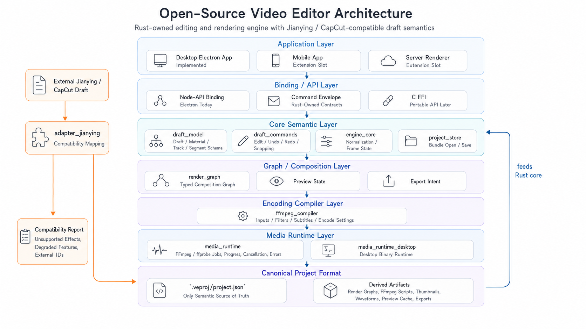

<p align="right">
  <a href="./README.zh-CN.md"><kbd>中文</kbd></a>
</p>

# Video Editor

Video Editor is a desktop-first, Jianying/CapCut-style video editor built on a
self-owned Rust editing and rendering engine.

The Electron desktop app is the first implemented client, but the core value of
this project is the shared engine underneath it: one canonical draft model, one
timeline command model, one render graph, and one FFmpeg compilation path that
can serve the desktop app, additional mobile clients, server rendering, and
external draft compatibility adapters.

## Architecture



There are two different flows in the architecture:

1. Main editing and rendering flow:
   Application clients call the API/binding layer, the Rust core owns draft and
   timeline semantics, the graph layer turns resolved editing state into render
   intent, the compiler layer turns that graph into FFmpeg execution plans, and
   runtime implementations execute preview/export jobs.
2. Compatibility flow:
   External Jianying/CapCut drafts go through adapters, which map external
   project data into Video Editor's canonical `.veproj/project.json` plus a
   compatibility report. The desktop app does not route through the adapter
   layer during normal editing.

## Layers

| Layer | Responsibility | Current shape |
| --- | --- | --- |
| Application layer | Product UX, file dialogs, workspace layout, command dispatch | `apps/desktop-electron` is implemented first; mobile and server clients are extension slots |
| API / binding layer | Stable command envelopes and client-facing service APIs | `bindings_node` exposes Rust-owned contracts to Electron; additional mobile/server bindings can target the same core |
| Compatibility adapter layer | Map external project formats into the canonical project model and report unsupported features | `adapter_jianying` is the next compatibility track; it imports Jianying/CapCut-style drafts into `.veproj` instead of becoming internal render semantics |
| Core semantic layer | Draft/material/track/segment/keyframe/filter/transition semantics, integer time model, command validation, undo/redo | `draft_model`, `draft_commands`, and `engine_core` own the editing model |
| Graph / composition layer | Resolve timeline state into typed render intent, separate from FFmpeg details | `render_graph` and `engine_core` keep composition decisions independent from process execution |
| Encoding compiler layer | Compile render graphs into FFmpeg inputs, filter scripts, subtitles, and encode settings | `ffmpeg_compiler` owns FFmpeg plan generation; UI code never builds FFmpeg commands |
| Media runtime layer | Discover and execute ffmpeg/ffprobe, report progress/errors, support cancellation boundaries | `media_runtime` defines runtime traits; `media_runtime_desktop` provides the desktop implementation |
| Project and derived artifacts | Persist canonical projects and keep generated artifacts out of source truth | `.veproj/project.json` is canonical; render graphs, FFmpeg scripts, thumbnails, waveforms, preview caches, proxies, and exports are derived |

## Current Status

| Area | Status |
| --- | --- |
| Rust workspace and toolchain | Implemented |
| Draft, material, project bundle, and schema model | Implemented |
| Timeline command core, snapping, main-track magnet behavior, undo/redo | Implemented |
| Electron desktop workspace | Implemented as the first client |
| Preview and export pipeline | In progress |
| Packaging, FFmpeg distribution review, and release hardening | Planned |
| Jianying/CapCut compatibility adapter | Next concrete adapter track |
| Mobile app and server rendering clients | Extension slots, not current product commitments |

## Repository Layout

```text
apps/desktop-electron/      Electron + React + TypeScript desktop editor
crates/draft_model/         Canonical draft/material/timeline schema and time model
crates/draft_commands/      Timeline edit commands, snapping, undo/redo
crates/engine_core/         Draft normalization and frame/timeline evaluation
crates/render_graph/        Typed render graph and render intent model
crates/ffmpeg_compiler/     Render graph to FFmpeg execution plans
crates/media_runtime/       ffmpeg/ffprobe traits, discovery, jobs, errors
crates/media_runtime_desktop/ Desktop process implementation for FFmpeg runtime
crates/project_store/       .veproj open/save/autosave and relative path handling
crates/preview_service/     Preview, thumbnail, waveform, and cache boundaries
crates/bindings_node/       Node-API surface for Electron
crates/testkit/             Fixtures, golden helpers, render smoke utilities
schemas/                    Generated JSON schemas
fixtures/                   Positive and negative draft/project fixtures
docs/                       Architecture and runtime boundary documentation
```

## Quick Start

Prerequisites:

- Rust `1.95.0`
- Node.js `24.12.0`
- pnpm `10.32.1`
- `just` for optional root recipes
- Bundled FFmpeg/ffprobe in
  `apps/desktop-electron/runtime/ffmpeg/<platform>-<arch>`; runtime code does
  not search `PATH` or accept per-binary FFmpeg overrides

```bash
corepack pnpm run desktop:open
```

`corepack pnpm run desktop:open` installs locked dependencies when needed,
builds the Electron desktop app, and launches the editor. `pnpm start` is kept
as a short alias. If you prefer `just`, use `just desktop-open`.

Build:

```bash
just build
```

Run the full local gate:

```bash
just test
```

Useful focused gates:

```bash
pnpm run test:rust
pnpm run test:desktop
pnpm run test:bindings
pnpm run test:render-smoke
```

## Project Format

Video Editor projects are stored as `.veproj` bundles. The canonical source of
truth is:

```text
.veproj/project.json
```

Derived artifacts must not become persisted semantic state:

- render graphs
- FFmpeg scripts
- thumbnails
- waveform data
- proxy files
- preview caches
- exported videos
- raw probe JSON

## Development Boundaries

- UI emits commands; Rust owns project and timeline semantics.
- UI code must not construct FFmpeg commands directly.
- Time math in persisted semantics uses integer microseconds, frame indices, or
  rational frame rates.
- Jianying-style vocabulary is preferred across model, IPC, UI, tests, and docs:
  draft, material, track, segment, keyframe, filter, transition.
- External draft identifiers are compatibility references only; they do not
  become internal render semantics.
- Kdenlive, MLT, and pyJianYingDraft are conceptual references only. This project
  does not copy GPL code, assets, XML definitions, presets, or UI implementation.

## Compatibility Adapter Direction

The Jianying/CapCut adapter is a mapping layer, not the engine itself. Its job is
to read external draft structures, translate the compatible subset into
`.veproj/project.json`, preserve external references where needed, and emit a
compatibility report for unsupported effects, transitions, filters, materials,
or timing features.

Once mapped, the imported project follows the same core engine path as native
Video Editor drafts.

## License

Video Editor is licensed under the [MIT License](./LICENSE).

Any release that redistributes FFmpeg binaries must also review LGPL/GPL/nonfree
build options, notices, source-offer obligations, and commercial distribution
requirements before shipping.
